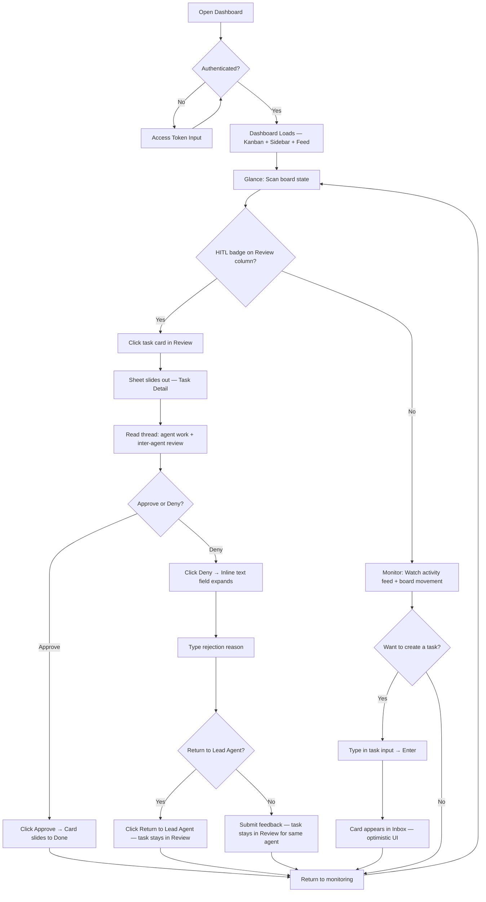
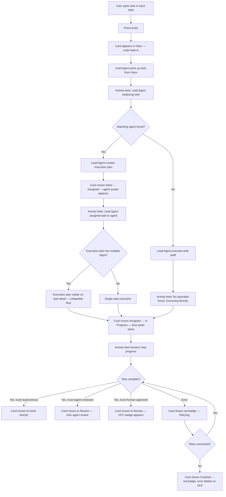
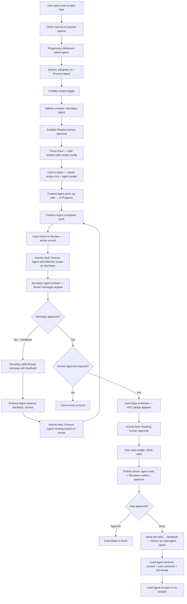

---
stepsCompleted:
  - step-01-init
  - step-02-discovery
  - step-03-core-experience
  - step-04-emotional-response
  - step-05-inspiration
  - step-06-design-system
  - step-07-defining-experience
  - step-08-visual-foundation
  - step-09-design-directions
  - step-10-user-journeys
  - step-11-component-strategy
  - step-12-ux-patterns
  - step-13-responsive-accessibility
  - step-14-complete
inputDocuments:
  - _bmad-output/planning-artifacts/prd.md
---

# UX Design Specification - nanobot-ennio

**Author:** Ennio
**Date:** 2026-02-22

---

<!-- UX design content will be appended sequentially through collaborative workflow steps -->

## Executive Summary

### Project Vision

nanobot Mission Control is a real-time command center for AI agent orchestration. The dashboard is the primary product surface — a single-screen experience where users create tasks, monitor agent activity, review inter-agent collaboration, and approve critical decisions. The UX must feel alive, responsive, and calm under information density.

### Target Users

**Primary (MVP):** Ennio — intermediate developer, daily power user managing personal productivity (finances, calendar, research) through 3 specialized agents. Uses desktop/laptop at localhost. Needs efficiency over aesthetics, but demands real-time visibility and one-click approvals.

**Secondary (Phase 2):** nanobot community developers — technically proficient, self-onboarding via YAML files and documentation. Need intuitive first-run experience with zero-code agent setup and immediate visual feedback.

### Key Design Challenges

1. **Information density management** — 5 simultaneous surfaces (Kanban, agent sidebar, activity feed, task detail, settings) must coexist without visual overwhelm
2. **HITL interruption design** — approval requests must be noticeable but not disruptive to monitoring flow
3. **Overview-to-detail transitions** — Kanban board overview vs. deep task detail (threads, execution plans, approval gates) without losing spatial context

### Design Opportunities

1. **Living dashboard** — real-time task transitions, agent activity pulses, and streaming indicators create an "alive" feeling that differentiates from static project boards
2. **Progressive disclosure for trust** — default autonomous, reveal review/approval options on demand, keeping 80% of task creation simple
3. **Execution plan visualization** — transform the Lead Agent's dependency table into a live-updating flow diagram, making orchestration visible and compelling

## Core User Experience

### Defining Experience

The Mission Control experience is a **monitoring-first dashboard with action bursts**. The primary loop:

1. **Glance** — See scheduled tasks and what agents are working on right now
2. **Monitor** — Watch task progress across the Kanban board and activity feed
3. **Act** — Create new tasks, approve completed work, or reject with feedback
4. **Return to monitoring** — agents resume, the board moves, the cycle continues

This is not a task-creation tool that you visit to create work and leave. It's a **persistent command center** you keep open — where the board is alive and agents are always moving. The user's role shifts between passive observer and active decision-maker.

### Platform Strategy

- **Desktop web SPA** — localhost deployment, browser-based
- **Mouse/click interaction** — no keyboard shortcuts required for MVP
- **Single-screen layout** — all 5 surfaces (Kanban, agent sidebar, activity feed, task detail, settings) visible or accessible without page navigation
- **Persistent session** — designed to stay open throughout the workday, not opened-and-closed

### Effortless Interactions

**Task creation:** As fast as typing a message. Input field always visible — type, hit enter, task appears in Inbox. Optional expansion for trust config and reviewer assignment (progressive disclosure).

**One-click approval:** Approve button on task card or detail view. Single click, no confirmation dialog. Task moves to Done instantly.

**HITL denial with context:** When rejecting, a text field appears inline for the user to describe *what wasn't approved and why*. This comment is:
- Saved on the task thread as a user message
- Visible to all agents in the review chain
- Option to **return to Lead Agent** with full thread history + user comment, so the Lead Agent can re-plan or re-assign with context

**Schedule visibility:** Configured recurring tasks (heartbeat-driven) are visible as upcoming items — the user sees what's planned before it runs.

### Critical Success Moments

1. **The autonomous review chain** — User watches a task go from Inbox → Assigned → In Progress → Review (inter-agent) → Review (HITL) → Done *without touching anything until the final approval*. This is the "aha" moment: agents collaborating and reviewing each other's work autonomously.

2. **The effortless delegation** — User types "Research AI agent trends for blog post" in the task input, hits enter, and watches the Lead Agent route it to the right agent within seconds. No configuration, no agent selection — just intent expressed, and agents act.

3. **The informed rejection** — User denies a task with a comment ("falta incluir o Spotify"), the feedback flows back through the system, and the agent revises. The user sees the task stay in Review, the thread grows with the revision, and the improved result comes back. The system *learned from the feedback*.

### Experience Principles

1. **Monitor by default, act by exception** — The dashboard is a monitoring surface. User intervention is the exception (approvals, rejections, new tasks), not the rule. Design for long stretches of passive observation interrupted by quick decisive actions.

2. **Every action is instant and visible** — Task creation, approval, rejection — all produce immediate visual feedback. No spinners for user actions. Optimistic UI updates. The board responds before the server confirms.

3. **Context travels with the task** — Thread history, reviewer feedback, user comments, execution plans — everything stays attached to the task. No separate logs to check, no context lost between agents. One click on a task reveals its full story.

4. **Progressive complexity** — Simple by default (type task, hit enter, autonomous execution). Complexity only appears when requested (trust config, reviewer assignment, execution plan details). 80% of interactions are one-step.

## Desired Emotional Response

### Primary Emotional Goals

**Satisfying control** — The dominant feeling when using Mission Control. The user opens the dashboard and immediately sees the full picture: which agents are active, what tasks are moving, what needs attention. Not anxious control (micromanaging) — *satisfied* control (everything is visible, everything makes sense, I'm in charge).

**Quiet competence** — The system should feel like a competent assistant, not a demanding tool. Agents work, tasks move, results appear. The dashboard communicates progress without demanding attention. When the user needs to act, the action is obvious and instant.

### Emotional Journey Mapping

| Moment | Desired Emotion | Anti-Pattern |
|--------|----------------|--------------|
| Opening dashboard in the morning | Satisfying control — "I can see everything" | Overwhelm — "too much happening" |
| Watching agents work in real-time | Calm trust — "they're handling it" | Anxiety — "is it working right?" |
| Receiving HITL approval request | Clear decisiveness — "I know what to do" | Interruption stress — "not another alert" |
| Approving a task (one-click) | Micro-accomplishment — "done, next" | Uncertainty — "did it actually work?" |
| Rejecting with feedback | Empowered correction — "I'm steering this" | Frustration — "why do I have to explain?" |
| Agent crash notification | Calm awareness — "noted, I'll handle it" | Panic — "everything's broken" |
| Reviewing autonomous chain completion | Pride in delegation — "my team handled it" | Suspicion — "did they actually do it right?" |

### Micro-Emotions

**Trust over skepticism** — Every agent action is visible in the activity feed. Every state transition is explicit on the board. Transparency builds trust. The user never wonders "what's happening?" — they can always see.

**Accomplishment over frustration** — Task creation is instant (type → enter). Approval is one click. Rejection has an inline text field ready. Every user action completes immediately with visual feedback. No dead ends, no waiting.

**Confidence over confusion** — The Kanban board is the single source of truth. Tasks are in exactly one state. Agent status is clear (active/idle/crashed). No ambiguous states, no "is it working?" moments.

### Design Implications

| Emotion | UX Design Approach |
|---------|-------------------|
| Satisfying control | Dashboard-first layout — Kanban board dominates the viewport, all key info visible without scrolling |
| Calm trust | Subtle animations for agent activity (gentle pulse, not flashing). Smooth task transitions, not abrupt jumps |
| Clear decisiveness | HITL approval: prominent but not aggressive notification badge. Approve/deny buttons always visible on the task, not buried in a menu |
| Calm error awareness | Crashed tasks: red badge indicator on the card, not a full-screen alert. Error details on click, not forced into view |
| Empowered correction | Rejection flow: inline text field expands smoothly. "Return to Lead Agent" as a clear secondary action |

### Emotional Design Principles

1. **Clean workspace aesthetic** — Light, airy, modern. White/light gray backgrounds, clear typography, ample spacing. ShadCN UI's default clean style is the baseline. Not a dark cockpit — a bright, organized workspace.

2. **Calm signals, not alarms** — Error states use color (red badge) and position (visible on the card), never sound, modals, or flashing. The user notices at their own pace, not on the system's schedule.

3. **Instant gratification** — Every user action produces immediate visual response. Optimistic UI: the board moves before the server confirms. The user never waits for feedback.

4. **Progressive attention** — Normal state: calm, minimal visual noise. Attention items (HITL requests, crashes) use subtle indicators (badges, color accents) that are noticeable but not disruptive. Detail on demand — click to expand, never forced.

## UX Pattern Analysis & Inspiration

### Inspiring Products Analysis

**Trello — The Kanban Reference**
- Core strength: instant visual clarity. You open it and *immediately* know what's where. Cards in columns, drag and drop, zero learning curve.
- What works: cards are information-dense but scannable (title, labels, avatar, due date visible without clicking). Columns map to workflow states. Creating a card is one click + type + enter.
- What to adopt: the card-based Kanban as the central interaction paradigm. Task creation speed. Visual simplicity.
- What to adapt: Trello is passive (humans move cards). Mission Control is *alive* (agents move cards autonomously). We need to convey motion and agency — cards that move themselves, status indicators that pulse.

**Grafana — The Anti-Pattern**
- Core problem: information overload without hierarchy. Every panel demands attention equally. No clear "start here" focal point. Configuration-heavy — dashboards require significant setup before being useful.
- What to avoid: equal visual weight on all elements. Dense grids of metrics without priority. Complex setup before first value. The feeling of "I need to learn this tool before I can use it."
- Lesson: Mission Control must have **clear visual hierarchy** — the Kanban board is primary, sidebar and activity feed are secondary, settings are tertiary. First-open experience should show something useful immediately.

### Transferable UX Patterns

**From Trello — Adopt:**
- Card-based Kanban as the primary interaction surface
- One-step task creation (always-visible input field)
- Column-based state visualization (maps perfectly to Inbox → Assigned → In Progress → Review → Done)
- Card preview shows key info (title, assigned agent, status badge) without clicking
- Clean, uncluttered card design with color-coded labels

**From chat/messaging apps — Adapt:**
- Threaded conversations within task detail (like Slack threads) for inter-agent messages
- Inline reply for HITL rejection feedback (like iMessage reply)
- Notification badges for items needing attention (like unread count)

**From monitoring dashboards (done right) — Adapt:**
- Activity feed as a secondary panel (like a log stream but human-readable)
- Agent status indicators in sidebar (like service health dots: green/yellow/red)
- Subtle real-time updates without full page refresh

### Anti-Patterns to Avoid

| Anti-Pattern | Why It's Bad | Our Alternative |
|-------------|-------------|-----------------|
| **Grafana-style equal-weight panels** | Everything screams for attention, nothing stands out | Clear hierarchy: Kanban dominant, sidebar secondary, feed tertiary |
| **Configuration before value** | User must set up dashboards before seeing anything useful | Dashboard works immediately with any registered agents — zero config for first view |
| **Dense metrics grids** | Cognitive overload for a daily-use tool | Progressive disclosure — summary on board, detail on click |
| **Modal dialogs for actions** | Breaks flow, demands full attention | Inline actions — approve on the card, reject with inline text field, create task in always-visible input |
| **Complex multi-step wizards** | Friction for frequent actions | One-step for common actions (create, approve). Multi-step only for rare config (agent creation with trust settings) |
| **Aggressive real-time updates** | Cards jumping around, layout shifting, visual chaos | Smooth CSS transitions for card movement. New items appear with subtle fade-in. No layout shifts that displace what you're looking at |

### Design Inspiration Strategy

**Adopt directly:**
- Trello's card-in-column Kanban pattern as the core layout
- One-step task creation paradigm (input field → enter → card appears)
- Card preview with essential info visible at glance
- Clean, minimal card design with ShadCN UI components

**Adapt for Mission Control:**
- Cards that move autonomously (Trello cards are static — ours are alive)
- Agent avatar/icon on cards showing who's working on what
- Gentle pulse animation on "In Progress" cards to show active work
- Activity feed as a collapsible side panel (not a separate page)
- Threaded messages inside task detail panel (slide-out or expandable)

**Avoid explicitly:**
- Equal visual weight on all dashboard elements (Grafana problem)
- Configuration required before first useful view
- Modal dialogs for frequent actions
- Aggressive layout shifts from real-time updates
- Information density without hierarchy

## Design System Foundation

### Design System Choice

**ShadCN UI** — a themeable, open-code component system built on Radix UI primitives + Tailwind CSS, with 60+ components, pre-built dashboard blocks, and beautiful defaults.

### Rationale for Selection

| Factor | ShadCN UI Fit |
|--------|--------------|
| Beautiful defaults | 60+ components with professional styling out of the box — clean, modern aesthetic matches "clean workspace" goal |
| Pre-built blocks | Dashboard block with sidebar + charts + data table, collapsible sidebar, authentication pages — directly applicable |
| Open code | Components copied into codebase, not installed as dependency. Full ownership, full customization, no version lock-in |
| Tailwind CSS | Utility-first styling for rapid customization. Design tokens via CSS variables for consistent theming |
| Radix UI primitives | Accessible by default — keyboard navigation, screen reader support, focus management built-in |
| Next.js native | First-class support — zero integration friction |
| Charts | Built-in chart components via Recharts — ready for future analytics (Phase 3) |
| Command menu | Built-in command palette — potential for quick actions (create task, search agents) |
| Data table | TanStack Table integration — agent list, task list views |
| AI-ready architecture | Open code allows LLMs to read, understand, and modify components — aligns with agent-assisted CLI |
| Ecosystem | Figma design system available (1000+ variants, 700+ blocks, 9+ dashboard templates) |

### Color Palette — "Clean Workspace + Calm Signals"

**Base palette (clean workspace):**

| Role | Color | Usage |
|------|-------|-------|
| Background | `#FFFFFF` (white) | Main dashboard background |
| Surface | `#F8FAFC` (slate-50) | Card backgrounds, sidebar |
| Border | `#E2E8F0` (slate-200) | Card borders, dividers |
| Text primary | `#0F172A` (slate-900) | Headings, task titles |
| Text secondary | `#64748B` (slate-500) | Descriptions, timestamps, metadata |

**Status palette (calm signals):**

| Status | Color | Usage |
|--------|-------|-------|
| Active / In Progress | `#3B82F6` (blue-500) | Active agent indicator, In Progress column accent |
| Success / Done | `#22C55E` (green-500) | Done column accent, approval confirmation |
| Review / Attention | `#F59E0B` (amber-500) | Review column accent, HITL notification badge |
| Error / Crashed | `#EF4444` (red-500) | Crashed badge, error indicators — used sparingly |
| Idle | `#94A3B8` (slate-400) | Idle agent indicator, inactive state |
| Inbox | `#8B5CF6` (violet-500) | Inbox column accent, new task indicator |

**Design tokens (Tailwind CSS variables):**

| Token | Purpose |
|-------|---------|
| `--primary` | Blue-500 — primary actions (create task, approve) |
| `--secondary` | Slate-100 — secondary surfaces |
| `--accent` | Violet-500 — highlights, new items |
| `--destructive` | Red-500 — reject, crash, error |
| `--muted` | Slate-400 — disabled, inactive |
| `--success` | Green-500 — completed, approved |
| `--warning` | Amber-500 — review, attention needed |

### Implementation Approach

**Starting blocks:**
- `dashboard-01` as the layout foundation (sidebar + main content area)
- `sidebar-07` (collapsible to icons) for the agent sidebar
- Login page block for authentication (access token)

**Key components to use:**
- `Card` — task cards on the Kanban board
- `Badge` — status indicators, notification counts
- `Button` — approve/deny actions
- `Input` — task creation field (always visible)
- `Textarea` — rejection feedback inline
- `Sheet` or `Drawer` — task detail slide-out panel
- `Avatar` — agent icons on cards and sidebar
- `Tabs` — task detail sections (thread, execution plan, config)
- `Command` — potential quick-action palette
- `DataTable` — agent list, task list views
- `Chart` — future analytics (Phase 3)

### Customization Strategy

- Minimal customization for MVP — use ShadCN defaults with color palette applied via Tailwind CSS variables
- Kanban board — custom component built from ShadCN `Card` primitives + CSS Grid for columns + Framer Motion for smooth card transitions
- Activity feed — custom component using ShadCN `ScrollArea` + streaming text rendering
- Agent sidebar — adapted from `sidebar-07` block with custom agent status indicators
- No custom design tokens beyond the palette — ShadCN's spacing, typography, and border radius defaults are clean enough for MVP

### Agent Configuration UX — nanobot Template Compliance

Agent creation (via YAML or CLI) must initialize the full nanobot workspace structure:

| Component | Path | Purpose |
|-----------|------|---------|
| Agent YAML config | `~/.nanobot/agents/{name}/config.yaml` | Name, role, skills, prompt, LLM model |
| Individual memory | `~/.nanobot/agents/{name}/memory/MEMORY.md` | Per-agent long-term facts (LLM-consolidated) |
| Individual history | `~/.nanobot/agents/{name}/memory/HISTORY.md` | Per-agent grep-searchable timestamped log |
| Global shared files | `~/.nanobot/workspace/` | AGENTS.md, SOUL.md, USER.md, TOOLS.md, IDENTITY.md — shared across all agents |
| Custom skills | `~/.nanobot/agents/{name}/skills/` | Per-agent skill files |

The dashboard's agent management view should reflect this structure — showing individual memory status and global shared context.

## Defining Experience

### The Core Interaction

**"Delegate with a sentence, watch your agents deliver."**

This is the interaction users will describe: *"I type what I need, hit enter, and watch my agents figure it out, route it, execute it, review each other's work, and bring me the result for approval."*

The defining experience combines two inseparable moments:
1. **The delegation** — typing a task in natural language and watching the Lead Agent route it instantly
2. **The living board** — cards moving across columns autonomously, agents working visibly, the dashboard alive without user intervention

Neither works without the other. Delegation without visibility creates anxiety ("is it working?"). Visibility without effortless delegation creates overhead ("why do I have to configure everything?"). Together they produce **satisfying control** — the user expresses intent, then watches it materialize.

### User Mental Model

**How users currently solve this problem:**
The target user (Ennio) currently manages agent tasks through CLI commands, terminal output, and manual coordination. There's no unified view of what all agents are doing, no visual state tracking, and no structured approval flow. The mental model is: "I tell an agent what to do, check back later, hope it worked."

**Mental model they bring to Mission Control:**
- **Kanban board** — from Trello, Jira, or any project tool. Columns = stages, cards = tasks, left-to-right = progress. This is deeply ingrained and requires zero learning.
- **Chat threads** — from Slack, WhatsApp, iMessage. Messages in sequence, newest at bottom, context stays in the thread. Applied to inter-agent collaboration and HITL feedback.
- **Command center** — from monitoring dashboards (but simpler). A single screen that tells you the state of everything at a glance.

**Where users may get confused:**
- If autonomous card movement feels unpredictable (card suddenly gone from a column)
- If the relationship between Lead Agent routing and task assignment isn't visible
- If the thread history is hard to follow when multiple agents contribute

**Resolution:** Smooth CSS transitions for card movement (never instant jumps), visible "assigned by Lead Agent" attribution on cards, and chronological threaded messages with clear agent avatars.

### Success Criteria

| Criteria | Indicator |
|----------|-----------|
| "This just works" | User types a task, hits enter, and sees it appear in Inbox within 200ms (optimistic UI) |
| "I feel in charge" | Opening the dashboard gives immediate overview — no loading states, no empty screens, all active tasks and agents visible |
| "I trust the system" | User watches a task complete the full Inbox → Done cycle without intervening, and the result is correct |
| "Actions are instant" | Approve click → card moves to Done. Reject click → inline text field appears. No modals, no spinners, no waiting |
| "I know what happened" | Clicking any task reveals its full story — creation, agent assignment, execution, inter-agent review, user feedback — all in one threaded view |
| "Agents are alive" | At least one visual indicator of agent activity at all times — pulse animation on In Progress cards, activity feed streaming, agent status dots updating |

### Novel vs. Established UX Patterns

**Pattern analysis: Familiar patterns combined in an innovative way.**

| Pattern | Type | Source | Mission Control Twist |
|---------|------|--------|-----------------------|
| Kanban board with columns | Established | Trello, Jira | Cards move autonomously — agents drive the board, not the user |
| Task creation input | Established | Trello, Slack | Always-visible, message-style input with progressive disclosure for trust config |
| Threaded messages | Established | Slack, Discord | Inter-agent collaboration visible as thread messages — the user sees agents talking to each other |
| One-click approval | Established | GitHub PR approvals | Inline on the card, no navigation — optimistic UI with instant board update |
| Live activity feed | Established | Log streams, chat | Human-readable event stream, not raw logs — filtered and formatted for monitoring |
| Autonomous card movement | **Novel** | None | Cards transition between columns via smooth animation when agents change task state — the board is alive |
| Execution plan visualization | **Novel** | None | Lead Agent's dependency table rendered as a visual flow on task detail — live-updating as steps complete |
| Inline HITL rejection with thread return | **Novel** | None | Reject → type reason → optionally return to Lead Agent with full thread context. Feedback loop visible as thread grows |

**Teaching strategy for novel patterns:** No explicit teaching needed. The novel patterns are extensions of familiar ones — an animated Kanban card is still a Kanban card, an execution plan is still a visual flow. Users discover the "alive" quality by watching, not by reading instructions.

### Experience Mechanics

**The core delegation-to-delivery cycle:**

**1. Initiation — Task Creation**
- User sees the always-visible input field at the top of the Kanban board
- Types a natural language task description (e.g., "Organize my finances for February")
- Hits Enter — card appears instantly in the Inbox column (optimistic UI, violet accent fade-in)
- *Optional expansion:* clicking a chevron on the input reveals trust config (autonomous / agent-reviewed / human-approved) and reviewer selection. Collapsed by default — 80% of tasks use the default trust setting

**2. Interaction — Agent Orchestration (Passive Monitoring)**
- Lead Agent picks up the task from Inbox — card moves to Assigned (smooth transition, agent avatar appears on card)
- Lead Agent creates an execution plan (visible as a collapsible flow on the task detail)
- Task moves to In Progress — card gets a gentle blue pulse animation
- Activity feed shows real-time entries: "Lead Agent assigned 'Organize finances' to Finance Agent", "Finance Agent started working on step 1/3"
- If the task involves inter-agent review, the card enters Review with an amber accent — agents reviewing each other's work

**3. Feedback — Real-Time Visual Signals**
- **Card position** tells the user the task's state (which column it's in)
- **Card accent color** signals status (blue pulse = active, amber = review, red badge = error)
- **Activity feed** streams human-readable events as they happen
- **Agent sidebar** shows which agents are active/idle with colored status dots
- **Badge count** on the Review column header shows how many tasks need HITL approval

**4. Completion — User Decision Point**
- Task reaches HITL Review — card shows Approve (green) and Deny (red) buttons directly on the card
- **Approve:** Single click → card slides to Done with green accent → micro-accomplishment feeling
- **Deny:** Click → inline text field expands smoothly → user types feedback → optionally clicks "Return to Lead Agent" → task stays in Review, thread grows with user comment, agents receive context and revise
- Task in Done column — the full thread (creation → assignment → execution → reviews → approval) is one click away

## Visual Design Foundation

### Color System

Established in Design System Foundation. Summary for reference:

- **Base palette:** White background, slate-50 surfaces, slate-200 borders, slate-900/500 text hierarchy
- **Status palette:** Blue (active), green (done), amber (review), red (error), slate-400 (idle), violet (inbox/new)
- **Design tokens:** Mapped to ShadCN CSS variables (`--primary`, `--secondary`, `--accent`, `--destructive`, `--muted`, `--success`, `--warning`)

**Accessibility compliance:** All status colors meet WCAG 2.1 AA contrast ratio (4.5:1) against white backgrounds. Text colors slate-900 (15.4:1) and slate-500 (4.6:1) both pass AA for their respective font sizes.

### Typography System

**Strategy:** Use ShadCN UI's default typography (Inter/system font stack) — clean, highly legible, modern sans-serif. No custom fonts for MVP.

**Font stack:**
- **Primary:** `Inter, ui-sans-serif, system-ui, -apple-system, sans-serif` — ShadCN default
- **Monospace:** `ui-monospace, SFMono-Regular, "SF Mono", Menlo, monospace` — for activity feed entries, agent messages, execution plan details

**Type scale (Tailwind defaults):**

| Element | Size | Weight | Usage |
|---------|------|--------|-------|
| Page title | `text-2xl` (24px) | `font-bold` (700) | "Mission Control" header |
| Column header | `text-lg` (18px) | `font-semibold` (600) | Kanban column titles (Inbox, Assigned, In Progress, Review, Done) |
| Card title | `text-sm` (14px) | `font-semibold` (600) | Task title on Kanban card (Card-Rich direction) |
| Card metadata | `text-xs` (12px) | `font-normal` (400) | Agent name, timestamp, status badge text |
| Body text | `text-sm` (14px) | `font-normal` (400) | Task detail thread messages, descriptions |
| Input text | `text-sm` (14px) | `font-normal` (400) | Task creation field, rejection feedback |
| Feed entry | `text-xs` (12px) | `font-normal` (400) | Activity feed items — monospace |

**Line heights:** ShadCN defaults — `leading-tight` (1.25) for headings, `leading-normal` (1.5) for body text. Sufficient for scannable card content.

**Rationale:** The dashboard is a monitoring surface, not a reading surface. Small, dense text (`text-sm`, `text-xs`) maximizes information density while maintaining legibility. Bold/semibold weights create clear hierarchy between card titles and metadata without increasing font sizes.

### Spacing & Layout Foundation

**Spacing unit:** 4px base (Tailwind default). All spacing uses multiples of 4px via Tailwind utility classes.

**Key spacing values:**

| Context | Spacing | Tailwind Class |
|---------|---------|----------------|
| Card internal padding | 14px | `p-3.5` |
| Card gap (between cards in column) | 8px | `gap-2` |
| Column gap (between Kanban columns) | 16px | `gap-4` |
| Section padding (sidebar, feed) | 16px | `p-4` |
| Input field height | 40px | `h-10` |
| Card border radius | 10px | `rounded-[10px]` |
| Badge border radius | 9999px | `rounded-full` |

**Layout structure — CSS Grid:**

```
+--------+------------------------------------------+----------+
| Agent  |           Kanban Board                   | Activity |
| Sidebar|  [Inbox] [Assigned] [In Progress]        | Feed     |
| (240px)|  [Review] [Done]                         | (280px)  |
|        |                                          |          |
| collap-|  (flex-1, fills available space)         | collap-  |
| sible  |                                          | sible    |
| to 64px|  +-- Task Input (full width, top) --+   |          |
|        |  +-- Columns (CSS Grid, equal) -----+   |          |
+--------+------------------------------------------+----------+
```

- **Agent sidebar:** 240px expanded, 64px collapsed (icon-only). ShadCN `sidebar-07` pattern.
- **Kanban board:** `flex-1` — fills remaining horizontal space. 5 columns in CSS Grid with `grid-template-columns: repeat(5, 1fr)`.
- **Activity feed:** 280px right panel, collapsible to hidden. ShadCN `ScrollArea` with auto-scroll.
- **Task detail:** ShadCN `Sheet` (slide-out from right), overlays activity feed when open. 480px wide.

**Layout density:** Efficient — cards use `p-3.5` (14px) padding with description preview and tags, columns are tight (`gap-2`), but comfortable enough that cards don't feel cramped. The Card-Rich direction favors information density per card over number of visible cards. The "clean workspace" aesthetic comes from consistent spacing, not excessive whitespace.

### Accessibility Considerations

**MVP accessibility baseline (ShadCN provides by default):**

| Requirement | Implementation |
|-------------|---------------|
| Color contrast | All text/background combinations meet WCAG 2.1 AA (4.5:1 for normal text, 3:1 for large text) |
| Keyboard navigation | Radix UI primitives provide focus management, arrow key navigation, and escape-to-close for all interactive components |
| Focus indicators | ShadCN default focus rings (`ring-2 ring-ring ring-offset-2`) on all interactive elements |
| Screen reader support | Radix UI provides ARIA attributes, role assignments, and live regions out of the box |
| Status not color-only | All status indicators combine color + text label (e.g., badge says "Review" in amber, not just an amber dot) |
| Motion sensitivity | Card transition animations use `prefers-reduced-motion` media query — disabled for users who request it |

**Not in MVP scope:** Full WCAG 2.1 AAA compliance, internationalization, screen reader optimization for Kanban drag interactions. Phase 2+ considerations.

## Design Direction Decision

### Design Directions Explored

Six directions were generated as interactive HTML mockups (`ux-design-directions.html`), all using the same data scenario (4 agents, tasks across all Kanban columns, HITL approvals pending, one crashed agent):

| Direction | Approach | Trade-off |
|-----------|----------|-----------|
| **A: Classic Clean** | Full sidebar (240px) + Kanban + feed (280px). Balanced, Trello-inspired | Baseline — no extreme strengths or weaknesses |
| **B: Compact Dense** | Narrower panels, smaller cards, tighter spacing | More cards visible, but less readable per card |
| **C: Board-First** | Collapsed sidebar (56px icons), maximized Kanban area | Maximum board space, but agent details require hover/click |
| **D: Activity-Forward** | Wider feed (360px) with rich narrative entries | Better agent story visibility, but Kanban columns narrower |
| **E: Card-Rich** | Larger cards with description preview, tags, progress bars | More info per card without clicking, but fewer cards visible |
| **F: Minimal Focus** | Borderless cards, subtle dividers, left-border color accents | Ultra-calm aesthetic, but less visual structure |

### Chosen Direction

**Direction E (Card-Rich) as the base**, enhanced with selective elements from other directions:

| Borrowed Element | From | Rationale |
|-----------------|------|-----------|
| Collapsible sidebar to icon-only mode | Direction C | Already planned with ShadCN `sidebar-07`. Gives board more space when agents don't need attention |
| Rich activity feed entries | Direction D | Human-readable entries with agent name + timestamp + description. Not terse logs — the feed tells the story of what agents are doing |
| Left-border color accent on cards | Direction F | Subtle 3px left border in status color (blue for active, amber for review, red for error) as a secondary status indicator alongside badges |

**Note:** Progress bars on In Progress cards are native to Card-Rich — no longer a borrowed element.

### Design Rationale

1. **Card-Rich provides more context at a glance** — description previews, tags, and progress bars on cards give the user immediate task context without clicking into detail views. This aligns directly with the "satisfying control" emotion — seeing more per card means less clicking to understand board state.
2. **Larger cards justify the information density** — increased padding (14px) and border radius (10px) give each card breathing room to display description preview and tags without feeling cramped.
3. **Collapsible sidebar** — sidebar content (agent list) is important but not primary. Collapsing to icons when monitoring the board maximizes the Kanban real estate.
4. **Rich feed entries** — the activity feed is where the "living dashboard" feeling comes from. Terse logs feel like a developer tool; narrative entries feel like watching a team work.
5. **Left-border accents** — adds a calm color signal without adding visual weight. Cards with amber left border immediately draw the eye to review items without needing to read the badge.
6. **Fewer visible cards is an acceptable trade-off** — Card-Rich cards are larger, so fewer fit per column. But the added context per card reduces the need to click into details, resulting in a net productivity gain for the monitoring-first use case.

### Implementation Approach

- Start with ShadCN `dashboard-01` block as layout skeleton
- Apply CSS Grid: `grid-template-columns: 240px 1fr 280px` (sidebar / board / feed)
- Sidebar: ShadCN `sidebar-07` with collapsible behavior (240px → 64px)
- Kanban: Custom component with `grid-template-columns: repeat(5, 1fr)` for 5 columns
- Cards: ShadCN `Card` with `p-3.5` (14px padding), `rounded-[10px]` (10px border radius), `border-left: 3px solid {status-color}`, description preview (`text-xs`, 2-line clamp), tags row (small pills), and progress bar on In Progress cards
- Card title: `text-sm font-semibold` (14px, 600 weight)
- Feed: ShadCN `ScrollArea` with custom feed item component (agent avatar + timestamp + description)
- All transitions: Framer Motion for card movement between columns, CSS transitions for sidebar collapse

## User Journey Flows

### Journey 1: Daily Monitoring & Approval

**Entry point:** User opens browser to `localhost:3000`. Dashboard loads with current state from Convex.



**Key interaction details:**

| Step | UI Element | Behavior |
|------|-----------|----------|
| Dashboard load | Full layout | All 3 panels render simultaneously. Convex reactive query populates board, sidebar, feed. No loading skeleton needed for localhost. |
| HITL badge | Column header badge | Amber badge with count (e.g., "2") on Review column. Visible at glance. |
| Task detail | ShadCN Sheet (480px) | Slides from right, overlays feed. Tabs: Thread (default), Execution Plan, Config. |
| Approve | Green button on card or detail | Single click. Optimistic: card moves to Done immediately. No confirmation dialog. |
| Deny | Red button → text field | Click expands inline `Textarea`. Submit saves as user message on thread. "Return to Lead Agent" is secondary action below. |
| Task creation | Always-visible input | Top of Kanban area. Enter key submits. Card appears in Inbox with violet fade-in (200ms). |

### Journey 2: Task Delegation (Lead Agent Routing)

**Entry point:** User types a task in the input field. No agent specified.



**Key interaction details:**

| Step | Visual Signal | Duration |
|------|-------------|----------|
| Task appears in Inbox | Violet fade-in, "New" badge | Instant (optimistic UI, <200ms) |
| Lead Agent analyzing | Feed entry with Lead Agent avatar | 1-3 seconds |
| Card moves to Assigned | Smooth CSS transition left→right, agent avatar fades in on card | 300ms transition |
| Card moves to In Progress | Smooth transition + blue pulse animation begins | 300ms transition, pulse continuous |
| Execution plan visible | Collapsible section on task detail Sheet — steps as vertical flow with checkmarks | On demand (click to expand) |
| Progress bar updates | Thin bar at card bottom fills incrementally (e.g., 1/3 → 2/3 → 3/3) | Updates per step completion |
| Error → Retrying | Card border flashes red once, badge changes to "Retrying" | Auto-retry up to 1x |
| Crashed state | Red left-border accent, red badge "Crashed", error icon | Persists until manual action |

### Journey 3: Inter-Agent Collaboration (Targeted Review)

**Entry point:** User creates task with review configuration.



**Key interaction details:**

| Step | UI Element | Behavior |
|------|-----------|----------|
| Progressive disclosure | Chevron on input field | Clicking expands a panel below input: agent selector, review toggle, reviewer selector, human approval checkbox. Collapses back when task is submitted. |
| Review config on card | Small icons on card | Review icon (circular arrows) + "HITL" badge if human approval enabled. Visible at glance without clicking. |
| Inter-agent thread | Task detail Sheet → Thread tab | Messages appear chronologically with agent avatars. Secretary's review feedback is visually distinct (amber background). User messages are distinct (blue background). |
| Revision cycle | Card stays in Review | Thread grows with each revision. User sees the conversation evolve — builds trust in the review process. |
| HITL after agent review | Badge change | Badge changes from "Agent Review" to "Needs Approval" when agent review passes. Badge color stays amber but text changes. |

### Journey Patterns

**Patterns reused across all journeys:**

| Pattern | Usage | Implementation |
|---------|-------|---------------|
| **Optimistic card movement** | Every state transition | Card moves immediately on action. Convex confirms async. If server rejects, card reverts with subtle shake animation. |
| **Activity feed narration** | Every agent action | Human-readable feed entry with agent avatar + timestamp + description. Feed auto-scrolls to latest. |
| **Sheet slide-out for detail** | Any card click | ShadCN Sheet (480px from right). Tabs for Thread / Execution Plan / Config. Closes with Escape or click outside. |
| **Inline action on card** | Approve/Deny in Review | Buttons directly on the card — no navigation needed. Deny expands text field inline. |
| **Progressive disclosure** | Task creation, settings | Default: simple (type + enter). Expanded: review config, trust settings, agent assignment. Chevron toggle. |
| **Badge-based attention** | HITL requests, errors | Amber/red badges on column headers and cards. Count badges. Never modals or forced alerts. |

### Flow Optimization Principles

1. **Zero-click monitoring** — Opening the dashboard immediately shows full state. No clicks needed to understand what's happening.
2. **One-click actions** — Approve, create task (Enter key), open detail (click card). The most common actions are single-interaction.
3. **Two-click for nuance** — Deny with feedback (click Deny + type + submit). Expand review config (click chevron + configure). Progressive disclosure keeps the default path short.
4. **Thread as single source of truth** — All context (agent work, inter-agent messages, user feedback, revisions) lives in one chronological thread. No separate views to check.
5. **Error recovery without panic** — Retrying state is automatic (1x). Crashed state shows error on click, not forced into view. Manual "Retry from Beginning" is available but not pushed.

## Component Strategy

### Design System Components (ShadCN UI)

**Components used directly (no customization):**

| ShadCN Component | Mission Control Usage |
|-----------------|----------------------|
| `Button` | Approve, Deny, Create task, Return to Lead Agent |
| `Input` | Task creation text field |
| `Textarea` | Rejection feedback inline field |
| `Badge` | Status badges (New, Assigned, In Progress, Review, Done, Crashed, HITL), column count |
| `Avatar` | Agent icons on cards and sidebar |
| `Sheet` | Task detail slide-out panel (480px from right) |
| `Tabs` | Task detail sections: Thread, Execution Plan, Config |
| `ScrollArea` | Activity feed scrollable container, Kanban column overflow |
| `Tooltip` | Agent status details on hover (collapsed sidebar mode) |
| `Separator` | Visual dividers in sidebar and detail panel |
| `Collapsible` | Execution plan expand/collapse, progressive disclosure panel |
| `Switch` | Review toggle in task creation, settings toggles |
| `Select` | Agent selector in task creation, reviewer selector |
| `Checkbox` | "Require human approval" in task creation config |

**Components used with minor customization:**

| ShadCN Component | Customization |
|-----------------|---------------|
| `Card` | Card-Rich styling: `p-3.5`, `rounded-[10px]`, `border-left: 3px solid {status-color}`, description preview (2-line clamp), tags row (pills), progress bar on In Progress cards, action buttons |
| `Sidebar` (`sidebar-07`) | Custom agent status indicators, collapsed icon-only mode with status dots |

### Custom Components

**1. KanbanBoard**

| Aspect | Specification |
|--------|--------------|
| **Purpose** | Primary interaction surface — displays all tasks organized by workflow state |
| **Content** | 5 columns (Inbox, Assigned, In Progress, Review, Done), each containing TaskCards |
| **Layout** | CSS Grid: `grid-template-columns: repeat(5, 1fr)`. Full height of main content area. |
| **States** | Default (populated), Empty (no tasks — shows subtle placeholder text per column) |
| **Behavior** | Cards animate between columns via Framer Motion `layoutId`. No manual drag-and-drop (agents move cards). |
| **Built from** | CSS Grid + ShadCN `ScrollArea` per column |

**2. TaskCard**

| Aspect | Specification |
|--------|--------------|
| **Purpose** | Visual representation of a single task on the Kanban board (Card-Rich direction) |
| **Anatomy** | Left border accent (3px, status color) + Title (`text-sm`, `font-semibold` / 14px, 600 weight) + Description preview (`text-xs`, 2-line clamp via `line-clamp-2`, muted color) + Tags row (small pills, `text-xs`, `rounded-full`, muted background) + Agent avatar dot + name (`text-xs`) + Status badge + Progress bar on In Progress cards (thin bar at card bottom) + Optional: approve/deny buttons |
| **Card styling** | `p-3.5` (14px padding), `rounded-[10px]` (10px border radius) |
| **States** | Default, Hover (elevated shadow), Active/In Progress (blue pulse animation + progress bar), Review (amber border), HITL Review (amber border + action buttons visible), Crashed (red border + red badge), Done (opacity 0.7) |
| **Variants** | Standard (board view — title + description preview + tags + agent + badge + progress bar) |
| **Actions** | Click → opens TaskDetailSheet. Approve button (Review state only). "Deny with feedback" button (Review state only). |
| **Accessibility** | `role="article"`, `aria-label="{task title} - {status}"`. Approve/Deny buttons have explicit aria-labels. |
| **Built from** | ShadCN `Card` + `Badge` + `Avatar` + `Button` |

**3. TaskInput**

| Aspect | Specification |
|--------|--------------|
| **Purpose** | Always-visible task creation field with progressive disclosure for advanced config |
| **Anatomy** | Text input (full width) + Create button + Chevron toggle for expanded options |
| **Expanded panel** | Agent selector (`Select`) + Review toggle (`Switch`) + Reviewer selector (`Select`, shown when review enabled) + Human approval checkbox (`Checkbox`) |
| **States** | Collapsed (default — input + button only), Expanded (progressive disclosure panel visible), Submitting (brief disabled state, 100ms) |
| **Behavior** | Enter key submits. Expanded panel collapses after submission. Default trust settings applied when collapsed. |
| **Accessibility** | `aria-expanded` on chevron toggle. Input has `placeholder` text as hint. |
| **Built from** | ShadCN `Input` + `Button` + `Collapsible` + `Select` + `Switch` + `Checkbox` |

**4. ActivityFeed**

| Aspect | Specification |
|--------|--------------|
| **Purpose** | Real-time stream of human-readable agent activity events |
| **Anatomy** | Feed header ("Activity Feed") + Scrollable list of FeedItems + Auto-scroll to bottom on new entries |
| **States** | Streaming (new items appearing), Idle (no new activity), Error (connection lost — subtle banner) |
| **Behavior** | Auto-scrolls to latest entry unless user has scrolled up (pause auto-scroll on manual scroll, resume when scrolled to bottom). New items fade in (200ms). |
| **Built from** | ShadCN `ScrollArea` + custom FeedItem components |

**5. FeedItem**

| Aspect | Specification |
|--------|--------------|
| **Purpose** | Single activity event in the feed |
| **Anatomy** | Timestamp (text-xs, monospace) + Agent name (font-medium) + Description (text-xs) |
| **Variants** | Normal (white background), Error (red-tinted border), HITL (amber-tinted — for approval-related events) |
| **Built from** | Custom component, no ShadCN dependency |

**6. AgentSidebarItem**

| Aspect | Specification |
|--------|--------------|
| **Purpose** | Agent entry in the sidebar showing identity and current status |
| **Anatomy** | Avatar (32px, colored, 2-letter initials) + Name (text-sm, font-medium) + Role (text-xs, muted) + Status dot (8px circle) |
| **States** | Active (blue dot with glow ring), Idle (gray dot), Crashed (red dot with glow ring) |
| **Collapsed variant** | Avatar only (36px) with status dot overlaid at bottom-right corner. Tooltip on hover shows name + role + status. |
| **Built from** | ShadCN `Avatar` + custom status dot + `Tooltip` |

**7. TaskDetailSheet**

| Aspect | Specification |
|--------|--------------|
| **Purpose** | Full task detail panel — the complete story of a task |
| **Anatomy** | Task title (text-lg, font-semibold) + Status badge + Assigned agent + Tabbed content: Thread / Execution Plan / Config |
| **Thread tab** | Chronological list of ThreadMessages. Newest at bottom. User messages (blue background), agent messages (white), review feedback (amber background). |
| **Execution Plan tab** | Vertical step list with status icons (pending dot, in-progress spinner, completed checkmark). Step dependencies shown as connecting lines. |
| **Config tab** | Read-only display of task trust settings, assigned agent, reviewers, timeout config. |
| **Actions** | Approve/Deny buttons in header (when in Review state). "Return to Lead Agent" secondary action after Deny. |
| **Built from** | ShadCN `Sheet` (side="right", 480px) + `Tabs` + `Badge` + `Button` + `Avatar` |

**8. ThreadMessage**

| Aspect | Specification |
|--------|--------------|
| **Purpose** | Single message in the task detail thread |
| **Anatomy** | Agent/User avatar (24px) + Author name + Timestamp + Message content |
| **Variants** | Agent message (white bg), User message (blue-50 bg), Review feedback (amber-50 bg), System event (gray-50 bg, italic) |
| **Built from** | Custom component with ShadCN `Avatar` |

**9. InlineRejection**

| Aspect | Specification |
|--------|--------------|
| **Purpose** | Expandable rejection feedback interface |
| **Anatomy** | Textarea (expands smoothly on Deny click) + Submit button + "Return to Lead Agent" secondary button |
| **States** | Hidden (default), Expanded (after Deny click, textarea focused), Submitting (brief disabled) |
| **Behavior** | Deny click → textarea expands with smooth animation (150ms). Submit saves comment as user thread message. "Return to Lead Agent" sends task back with full thread + user comment. |
| **Built from** | ShadCN `Textarea` + `Button` + Framer Motion for expand animation |

### Component Implementation Strategy

- **All custom components are compositions of ShadCN primitives** — no fully custom UI elements. Visual consistency with the design system and accessibility inheritance from Radix UI.
- **Framer Motion for animations only** — card transitions between columns (`layoutId`), inline rejection expansion, feed item fade-in. All other interactions use CSS transitions.
- **No component library abstraction** — components live in `src/components/` as standard React components. No Storybook, no separate package. ShadCN's open-code philosophy: components are project code, not dependencies.

### Implementation Roadmap

**Phase 1 — Core (MVP launch):**

| Priority | Component | Needed For |
|----------|-----------|------------|
| P0 | KanbanBoard + KanbanColumn | All journeys — the primary surface |
| P0 | TaskCard (Card-Rich: description preview, tags, progress bar) | All journeys — visual task representation with at-a-glance context |
| P0 | TaskInput (collapsed mode) | Journey 1, 2 — task creation |
| P0 | ActivityFeed + FeedItem | Journey 1, 2 — real-time monitoring |
| P0 | AgentSidebarItem | All journeys — agent visibility |
| P0 | TaskDetailSheet (Thread tab only) | Journey 1, 3 — task detail + HITL |
| P0 | InlineRejection | Journey 1, 3 — HITL denial flow |

**Phase 2 — Enhanced (post-MVP):**

| Priority | Component | Needed For |
|----------|-----------|------------|
| P1 | TaskInput (expanded mode — progressive disclosure) | Journey 3 — review configuration |
| P1 | TaskDetailSheet (Execution Plan tab) | Journey 2 — execution plan visualization |
| P1 | TaskDetailSheet (Config tab) | Journey 3 — trust config view |
| P1 | ThreadMessage variants (review feedback styling) | Journey 3 — visual distinction |

**Phase 3 — Polish:**

| Priority | Component | Needed For |
|----------|-----------|------------|
| P2 | AgentSidebarItem collapsed variant | Board-first layout — maximize Kanban space |
| P2 | Command palette (ShadCN `Command`) | Quick task creation, agent search |

## UX Consistency Patterns

### Action Hierarchy

**Button levels — consistent across all surfaces:**

| Level | Style | Usage | Examples |
|-------|-------|-------|----------|
| **Primary** | ShadCN `default` — solid blue-500 fill, white text | The single most important action in context | "Create" (task input), "Approve" (HITL review) |
| **Destructive** | ShadCN `destructive` — solid red-500 fill, white text | Actions with negative or irreversible consequences | "Deny" (HITL rejection) |
| **Secondary** | ShadCN `secondary` — gray-100 fill, dark text | Supporting actions, alternatives | "Return to Lead Agent" (after denial), chevron toggle |
| **Ghost** | ShadCN `ghost` — no fill, text only, hover reveals bg | Low-emphasis actions, navigation | Sidebar collapse toggle, feed filter |

**Rules:**
- Maximum one primary button per visible context (card, sheet header, input bar)
- Destructive actions never appear alone — always paired with a primary alternative (Approve + Deny)
- No confirmation dialogs for approve/deny — optimistic UI with undo potential via thread history

### Feedback Patterns

**User action feedback — instant and visual:**

| Action | Feedback | Duration |
|--------|----------|----------|
| Task created | Card fades into Inbox column (violet accent) | 200ms fade-in |
| Task approved | Card slides from Review to Done (green flash on border) | 300ms transition |
| Task denied | Inline textarea expands, card stays in Review | 150ms expand animation |
| Rejection submitted | Textarea collapses, new thread message appears, subtle confirmation | 150ms collapse + feed entry |
| Settings saved | Subtle green checkmark next to save button (auto-fades) | 1.5s visible, then fade |

**System feedback — calm signals:**

| Event | Signal | Visibility |
|-------|--------|------------|
| Agent started working | Card blue pulse animation begins + feed entry | Passive — noticed during monitoring |
| Agent completed step | Progress bar increment + feed entry | Passive |
| Task moved to Review | Card amber border + HITL badge count updates + feed entry | Badge draws attention at user's pace |
| Agent error (retrying) | Card red flash once + "Retrying" badge + feed entry | Visible but not alarming |
| Agent crashed | Card red border + "Crashed" badge + feed entry (red-tinted) | Visible, persistent until resolved |
| Connection lost | Subtle banner at top of feed: "Reconnecting..." | Non-blocking |
| Connection restored | Banner disappears, feed catches up | Automatic |

### State Patterns

**Empty states — helpful, not sad:**

| Context | Empty State |
|---------|------------|
| No tasks on board | Centered text in Kanban area: "No tasks yet. Type above to create your first task." |
| Empty column | Subtle muted text at column bottom: "No tasks" |
| No agents registered | Sidebar shows: "No agents found. Add a YAML config to `~/.nanobot/agents/`" |
| Empty activity feed | Feed area shows: "Waiting for activity..." in muted italic |
| Empty task thread | Thread tab shows: "No messages yet. Agent activity will appear here." |

**Loading states — minimal:**

| Context | Loading State |
|---------|-------------|
| Dashboard initial load | Full layout renders immediately. Convex reactive query populates data. No skeleton screens for localhost. |
| Task detail Sheet open | Sheet slides out immediately. Content populates from Convex cache (typically instant). |
| Feed reconnecting | "Reconnecting..." banner. Feed shows last known entries. |

**Error states — calm awareness:**

| Context | Error Display |
|---------|-------------|
| Task crashed | Red left-border on card + "Crashed" badge. Click → Sheet shows error details in thread (monospace). "Retry from Beginning" button in Sheet header. |
| Agent crashed | Red status dot (with glow) in sidebar. Tooltip shows: "Crashed — last active {timestamp}". |
| Convex write failed | Feed shows error entry: "Failed to update: {description}." Red-tinted. No modal. |
| Invalid task input | Input border turns red. Small text below: "Task description required." Clears on re-focus. |

### Real-Time Update Patterns

**How autonomous changes appear without disrupting the user:**

| Pattern | Rule |
|---------|------|
| **Card movement** | Smooth Framer Motion transition (300ms). Card animates from source to destination column. No instant jumps. |
| **New card in column** | Fade-in (200ms) at the top of the column. No layout shift for existing cards. |
| **Badge count update** | Number increments/decrements without animation. Amber glow pulse once on increment. |
| **Feed new entry** | Fades in at bottom. Auto-scroll if user is at bottom. If scrolled up: no auto-scroll, "New activity" indicator. |
| **Agent status change** | Status dot color transitions smoothly (CSS transition 200ms). |
| **Card content update** | Text updates in place. No card resize animation. Badge text updates without flicker. |

**Anti-disruption rules:**
1. Never move a card the user is hovering over or has clicked
2. Never auto-scroll the feed if the user is reading above the fold
3. Never change the layout of the Sheet while the user is reading it
4. If a task in the open Sheet gets updated, show a subtle "Updated" indicator — content refreshes in place without closing

### Design System Integration Rules

| Rule | Implementation |
|------|---------------|
| All colors from token palette | No hardcoded hex values. Use `var(--primary)`, `var(--destructive)`, etc. |
| All spacing from Tailwind scale | Only `p-2`, `p-3`, `p-3.5`, `p-4`, `gap-2`, `gap-4`. No arbitrary pixel values except Card-Rich card border radius. |
| All border radius from ShadCN | `rounded-[10px]` for cards (Card-Rich), `rounded-full` for badges/dots/tags, `rounded-md` for buttons/inputs. |
| All typography from type scale | No custom font sizes. Use `text-xs`, `text-sm`, `text-lg`, `text-2xl` only. |
| All transitions from motion scale | Card movement: 300ms. Fade-in: 200ms. Expand/collapse: 150ms. Status dot: 200ms. |

## Responsive Design & Accessibility

### Responsive Strategy

**MVP: Desktop-only.** Mission Control is a localhost dashboard designed for persistent desktop use. No mobile or tablet breakpoints needed.

**Desktop viewport strategy:**

| Viewport Width | Layout Behavior |
|---------------|----------------|
| **< 1024px** | Not supported for MVP. Subtle banner: "Mission Control is designed for desktop browsers (1024px+)." |
| **1024px – 1279px** | Sidebar collapsed by default (64px icons). Kanban columns narrower. Activity feed collapsible. |
| **1280px – 1535px** | Full layout: sidebar expanded (240px) + 5 Kanban columns + feed (280px). Default experience. |
| **1536px+** | Extra space distributed to Kanban columns. Cards get more breathing room. Sidebar and feed stay fixed width. |

**Phase 2 consideration:** If community adoption requires remote access (not localhost), tablet support may be added. The CSS Grid layout is inherently flexible — collapsing sidebar + hiding feed would create a usable tablet Kanban view.

### Breakpoint Strategy

**Tailwind breakpoints used:**

| Breakpoint | Width | Usage |
|-----------|-------|-------|
| `lg` | 1024px | Minimum supported. Sidebar collapses, feed becomes toggle. |
| `xl` | 1280px | Default layout — all panels visible. |
| `2xl` | 1536px | Extra Kanban space. |

**Implementation:** Desktop-first (not mobile-first). Base styles assume full layout. `lg` breakpoint applies constraints for smaller desktops/laptops.

### Accessibility Strategy

**Target: WCAG 2.1 AA** — industry standard, achievable with ShadCN/Radix defaults.

**Inherited from ShadCN/Radix UI (no custom work):**

| Requirement | How It's Covered |
|-------------|-----------------|
| Color contrast (4.5:1 text, 3:1 large text) | All palette colors verified against white/slate-50 backgrounds |
| Keyboard navigation | Radix primitives: Tab, Arrow keys, Enter, Escape for all interactive components |
| Focus indicators | ShadCN `ring-2 ring-ring ring-offset-2` on focus-visible |
| ARIA roles and labels | Radix auto-applies: `role="dialog"` for Sheet, `role="tablist"` for Tabs, `role="switch"` for Switch |
| Screen reader announcements | Radix `aria-live` regions for dynamic content changes |

**Mission Control-specific accessibility additions:**

| Requirement | Implementation |
|-------------|---------------|
| **Kanban board semantics** | Board: `role="region"` with `aria-label="Task board"`. Columns: `role="group"` with `aria-label="{column name} - {count} tasks"`. |
| **Card as article** | `role="article"` with `aria-label="{title} - {status} - assigned to {agent}"` |
| **Real-time updates** | Activity feed container: `aria-live="polite"` — screen reader announces new entries without interrupting |
| **Status not color-only** | All status indicators use color + text label. Badges always include status text. |
| **Motion sensitivity** | All Framer Motion animations wrapped in `prefers-reduced-motion` check. Reduced motion: instant transitions, no pulse. |
| **Sheet focus trap** | When TaskDetailSheet opens: focus moves to sheet. Tab cycles within sheet. Escape closes. Focus returns to triggering card. |

### Testing Strategy

**MVP testing approach (pragmatic for solo developer):**

| Test Type | Tool | Frequency |
|-----------|------|-----------|
| Color contrast | Browser DevTools accessibility audit | Once during design token setup |
| Keyboard navigation | Manual testing (Tab through all interactive elements) | Per new component |
| Screen reader | VoiceOver (macOS built-in) spot check | Per new component |
| Automated audit | Lighthouse accessibility score (target 90+) | Before launch |
| Reduced motion | `prefers-reduced-motion` toggle in DevTools | Once during animation setup |

### Implementation Guidelines

1. **Semantic HTML first** — Use `<nav>`, `<main>`, `<aside>`, `<article>`, `<section>` before adding ARIA roles
2. **Don't override Radix** — Radix accessibility attributes are battle-tested. Don't remove or override `aria-*` attributes
3. **Test with keyboard** — Every interactive element must be Tab-reachable and operable with Enter/Space/Escape
4. **Announce dynamic changes** — Use `aria-live="polite"` on feed and board containers. Never `assertive` (too disruptive for monitoring)
5. **Skip link** — "Skip to Kanban board" as first focusable element, hidden until focused
